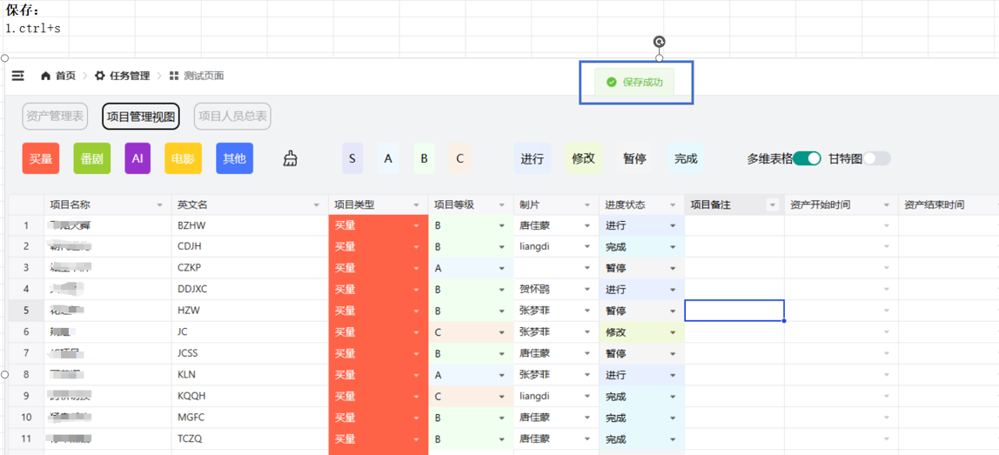

# 智能表格任务管理平台项目介绍

## 项目概述

智能表格任务管理平台是一个面向制片、主管、制作三类角色的数字化团队协作系统，通过类Excel交互式表格引擎，实现任务全生命周期的智能化管理。

## 核心架构

- **技术栈**：FastAPI + Vue分布式前后端分离架构
- **数据层**：MySQL多维度关系建模，支持表级分区与读写分离
- **表格引擎**：集成Handsontable实现Excel级别的交互体验
- **权限体系**：RBAC动态权限控制，支持多角色精细化管理

## 原有核心功能

### 1. 智能任务管理

- **任务创建与分配**：支持批量创建、智能分配给合适团队成员
- **进度追踪**：实时监控任务状态，可视化进度展示
- **多级审核**：制片→主管→制作的完整审批流程

### 2. 高效表格操作

- **单元格级数据校验**：实时验证数据有效性
- **智能公式计算**：支持复杂业务逻辑计算
- **版本对比功能**：追踪数据变更历史，支持版本回滚

## AI增强功能

### 3. 智能内容生成

- **AI任务描述优化**：自动完善任务描述，提高执行清晰度
- **智能标签生成**：基于任务内容自动生成分类标签
- **模板推荐**：根据项目类型智能推荐最佳表格模板

### 4. 预测分析能力

- **工期智能预估**：基于历史数据预测任务完成时间
- **资源冲突预警**：提前识别人员排期冲突
- **项目风险评估**：智能分析项目延期风险并提供建议

### 5. 智能辅助决策

- **数据异常检测**：自动识别录入错误和逻辑问题
- **优先级智能排序**：基于紧急程度和重要性自动调整任务优先级
- **绩效智能分析**：生成团队和个人效率报告

通过AI能力的加持，平台操作效率相比传统表单提升40%，实现了从数字化工具向智能化助手的升级。

### 框架包含 🔨

- 使用 Vue3.4 + TypeScript 开发，单文件组件**＜script setup＞**
- 采用 Vite5 作为项目开发、打包工具（配置 gzip/brotli 打包、tsx 语法、跨域代理…）
- 使用 Pinia 替代 Vuex，轻量、简单、易用，集成 Pinia 持久化插件
- 使用 TypeScript 对 Axios 整个二次封装（请求拦截、取消、常用请求封装…）
- 基于 Element 二次封装 [ProTable](https://juejin.cn/post/7166068828202336263) 组件，表格页面全部为配置项 Columns
- 支持 Element 组件大小切换、多主题布局、暗黑模式、i18n 国际化
- 使用 VueRouter 配置动态路由权限拦截、路由懒加载，支持页面按钮权限控制
- 使用 KeepAlive 对页面进行缓存，支持多级嵌套路由缓存
- 常用自定义指令开发（权限、复制、水印、拖拽、节流、防抖、长按…）
- 使用 Prettier 统一格式化代码，集成 ESLint、Stylelint 代码校验规范
- 使用 husky、lint-staged、commitlint、czg、cz-git 规范提交信息

### 安装使用步骤 📔

- **Install：**

```text
pnpm install
```

- **Run：**

```text
pnpm dev
pnpm serve
```

- **Build：**

```text
# 开发环境
pnpm build:dev

# 测试环境
pnpm build:test

# 生产环境
pnpm build:pro
```

- **Lint：**

```text
# eslint 检测代码
pnpm lint:eslint

# prettier 格式化代码
pnpm lint:prettier

# stylelint 格式化样式
pnpm lint:stylelint
```

- **commit：**

```text
# 提交代码（提交前会自动执行 lint:lint-staged 命令）
pnpm commit
```

### demo功能📷

<video controls src="demo展示.mp4" title="Title"></video>

## 管理平台-开发阶段

## 阶段一：产品需求分析、交互逻辑与系统框架设计

明确需求，设计交互逻辑，搭建系统框架，确保项目能够按计划推进

## 阶段二：分析具化需求，形成初步方案

进一步明确平台的功能细节，完善方案，确保开发过程中有明确的目标和计划。

## 阶段三：实现闭环功能与优化页面交互体验

1. 实现任务管理闭环功能
2. 前端页面优化与交互体验提升
3. 系统性能优化与稳定性提升
4. 用户反馈与持续优化
   

## 技术框架


## 多维表格模块


## 项目管理视图


## 资产管理表


## 项目人员总表


## 项目管理-页面构成


## 项目管理-功能解析


## 项目管理-保存方式


